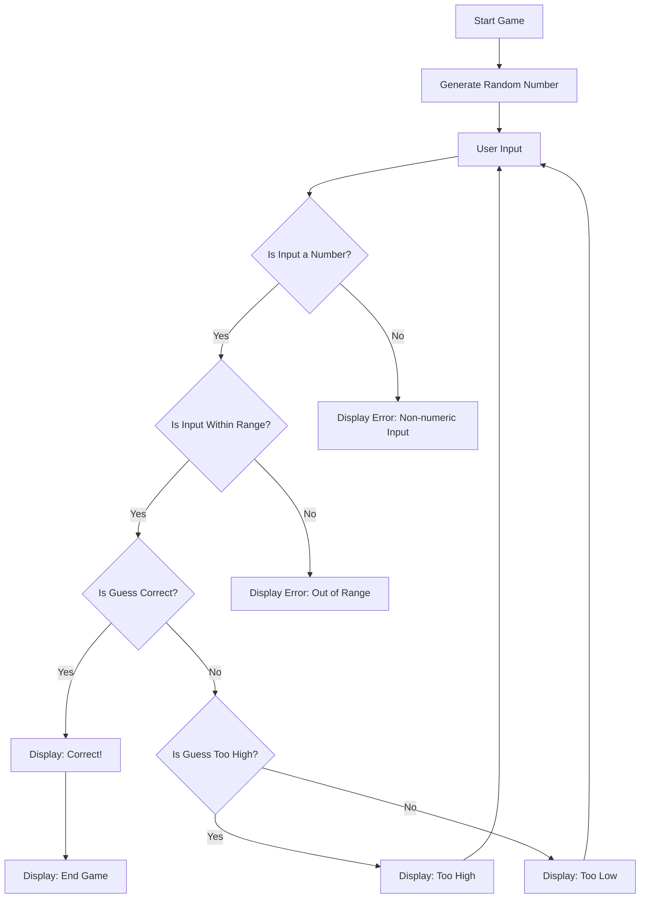

1. Start Game: Start of the game.
2. Generate Random Number: The game generates a random number within the given range.
3. User Input: The player inputs their guess.
4. Is Input Numeric?: Check if the input is a number.
  1. Yes: Check if the input is within the valid range.
  2. No: Display an error message for non-numeric input and ask for input again.
5. Is Input Within Range?: Make sure the user input is in the allowed range.
  1. Yes: Check if the guess is correct.
  2. No: Display an error message for out-of-range input and ask for input again.
6. Is Guess Correct?: See if the user's guess matches the generated number.
  1. Yes: Display a success message.
  2. No: Check if the guess is too high or too low.
7. Is Guess Too High?: Provide feedback based on the guess.
  1. Yes: Indicate that the guess was too high and ask for another input.
  2. No: Indicate that the guess was too low and ask for another input.
